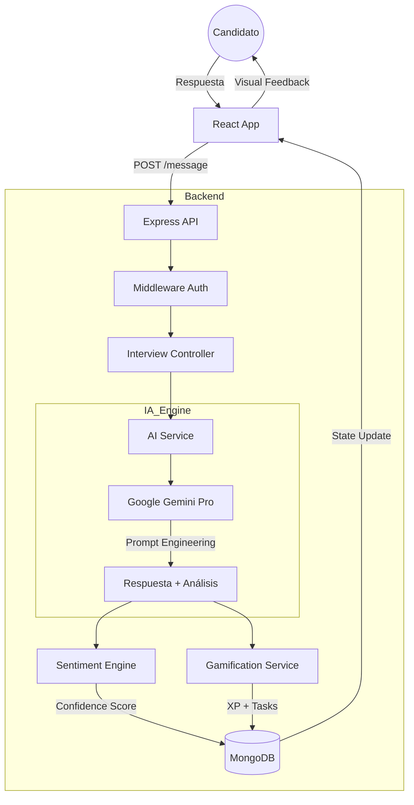

# 🏗️ Documentación Arquitectónica - Interview AI

Este documento detalla la estructura técnica avanzada del sistema, el flujo de datos y la integración de servicios de IA.

## 📐 Diagrama de Flujo de Datos

---

## 📂 Estructura de Directorios (Módulos)

### 1. `src/services/ai.service.js`
Es el puente con el LLM. Utiliza prompts estructurados para forzar salidas en JSON, permitiendo que la IA se comporte como un backend determinista. Maneja:
- Generación de diálogos.
- Evaluación técnica.
- Extracción de sentimientos.

### 2. `src/services/task.service.js`
El motor de misiones. Implementa la lógica de **Aprendizaje Adaptativo**:
- Si el usuario falla, genera un `studyPlan` correctivo.
- Gestiona la persistencia de XP y el cálculo de niveles dinámicos.

### 3. `src/utils/gamification.js`
Lógica matemática pura. Define las curvas de aprendizaje y los umbrales de XP para los rangos (Junior -> Staff).

---

## 💾 Diseño de Base de Datos (Evolutivo)

Se utiliza una base de datos NoSQL (**MongoDB**) para permitir la flexibilidad en los objetos de feedback que genera la IA, los cuales pueden variar según el rol.

### Relación de Documentos
- **Uno a Muchos**: Un `User` tiene múltiples `Interviews`.
- **Embebido**: Los `messages` y `dailyTasks` se almacenan dentro de sus respectivos documentos para optimizar la velocidad de lectura (Latencia < 100ms).

---

## 🔐 Seguridad y Escalabilidad

- **Stateless Auth**: Uso de JWT para permitir escalado horizontal.
- **Error Handling Centralizado**: Middleware de error que captura fallos de la API de Gemini y activa fallbacks locales.
- **Validación Estricta**: Zod asegura que los datos que llegan a la lógica de negocio sean 100% íntegros.

---

## 📊 Estrategia de IA: Prompt Engineering

El sistema no solo envía texto, sino que inyecta el **Historial de Mensajes** y las **Preferencias del Usuario** en cada interacción. Esto crea una IA con "memoria" y "empatía técnica", capaz de ajustar su nivel de dificultad según el desempeño del candidato.
